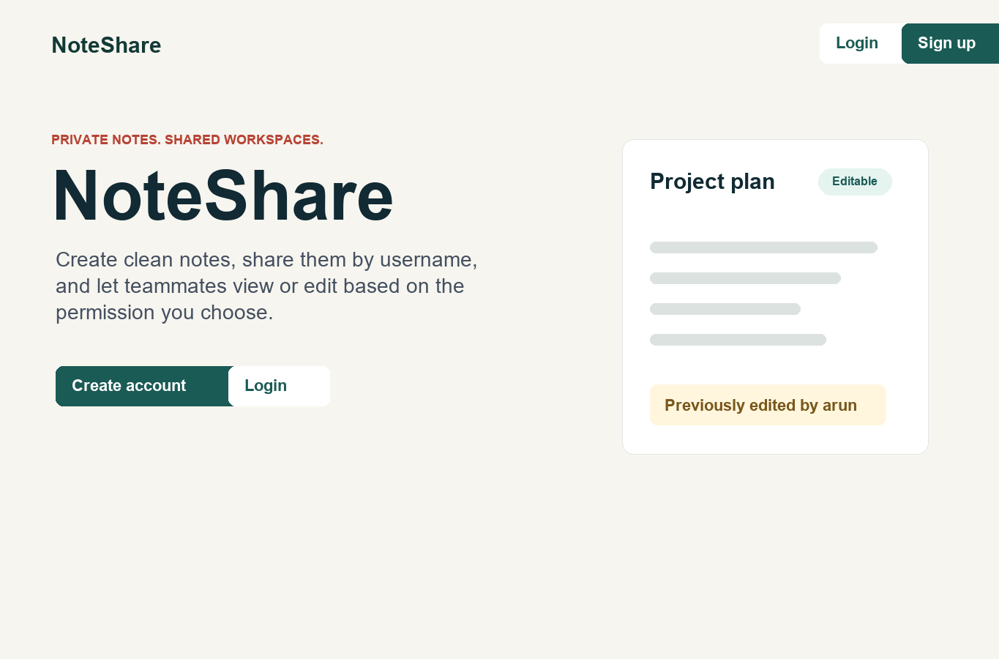
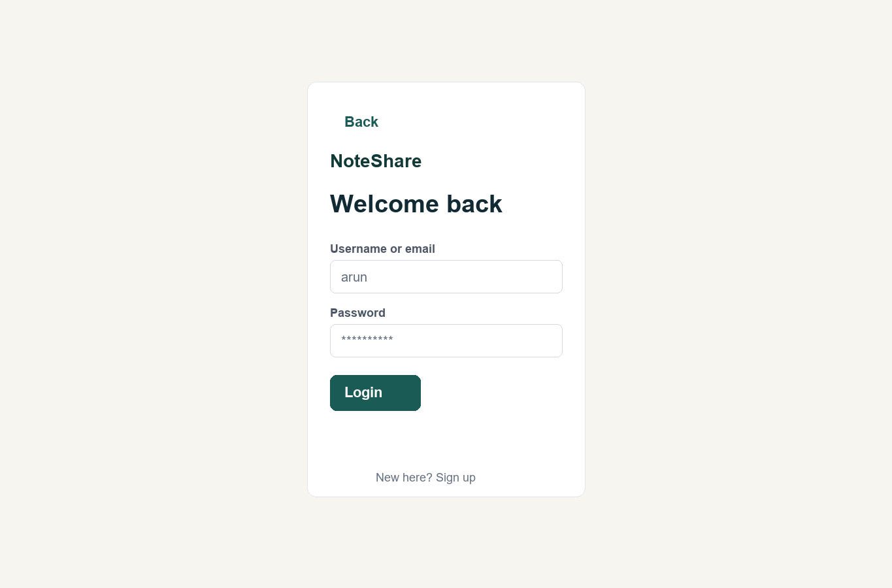
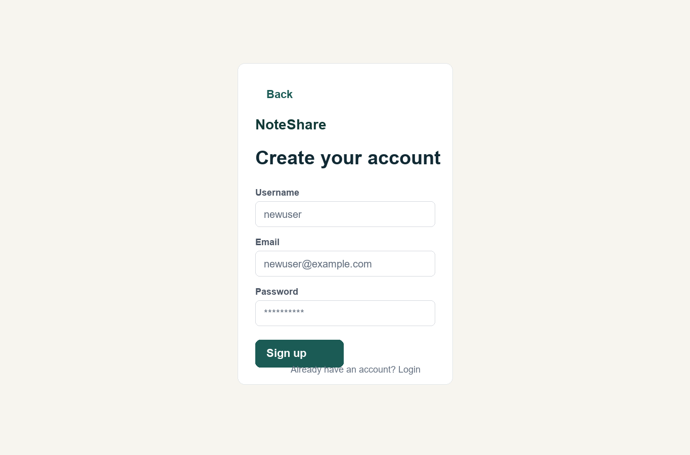
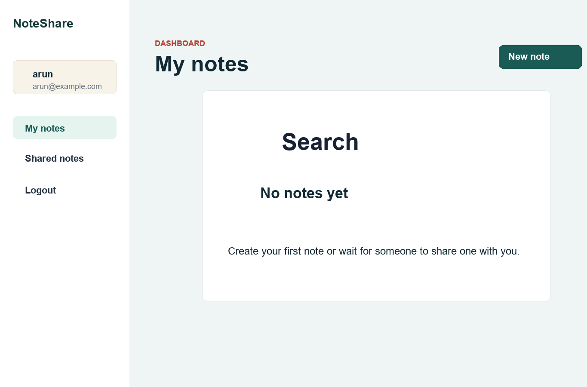
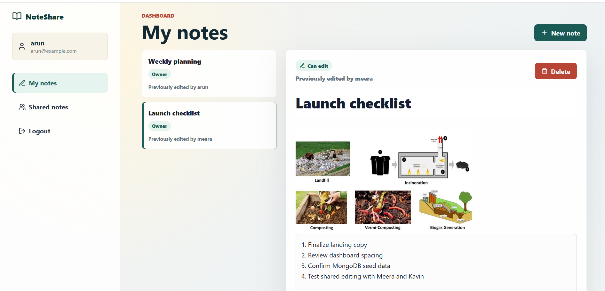
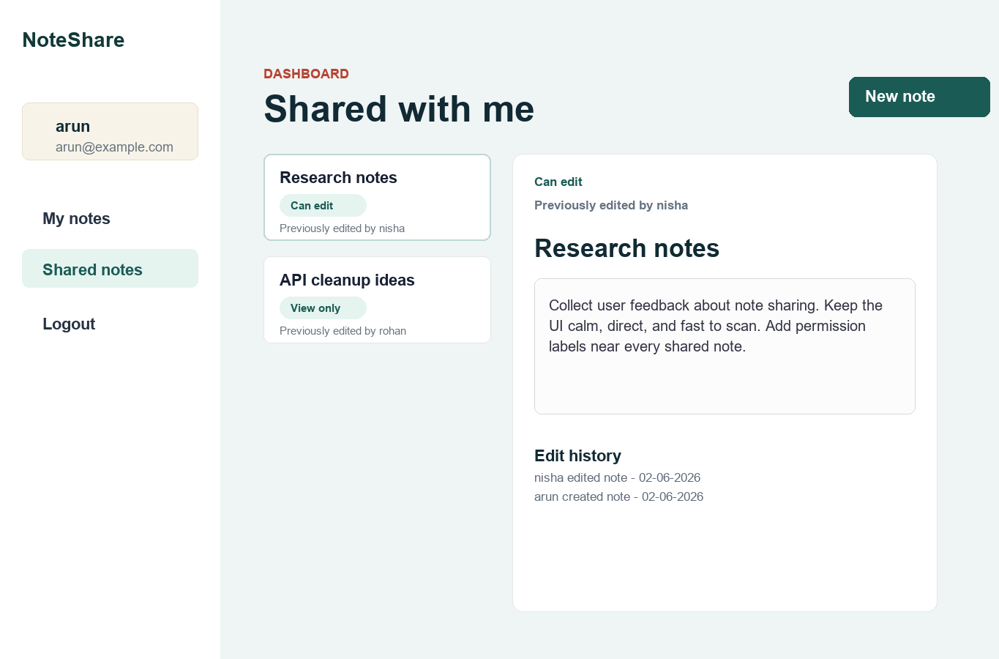
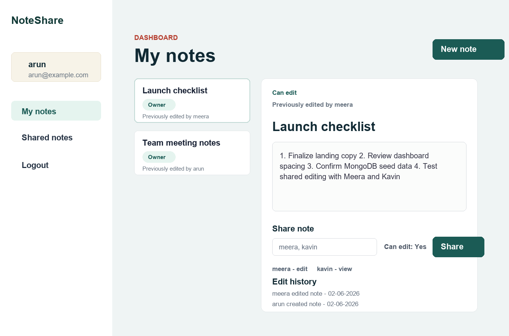

# NoteShare

NoteShare is a MERN stack collaborative notes sharing web app. Users can create an account, write notes, attach note images, share notes with other users by username, and control whether shared users can view or edit the note.

## Features

- Landing page with Login and Sign up actions
- User signup and login
- Password hashing with `bcryptjs`
- JWT-based protected API routes
- Unique username and email validation
- Dashboard with profile, My notes, and Shared notes
- Create, edit, and delete notes
- Add a description/content body to every note
- Upload and display note images
- Share notes with multiple users by username
- Set shared-note permissions as view-only or editable
- Edit-history tracking such as previously edited by username
- MongoDB persistence with Mongoose models
- Seed script with sample users, shared notes, images, and edit history

## UI Screenshots

### Landing Page



### Login Page



### Signup Page



### Dashboard



### My Notes



### Shared Notes



### Note Sharing and Edit History



## Tech Stack

### Frontend

- React
- Vite
- CSS
- Lucide React icons

### Backend

- Node.js
- Express.js
- MongoDB
- Mongoose
- JWT authentication
- `bcryptjs` for password hashing
- `multer` for image uploads

## Project Structure

```text
note-share-app/
  src/                 React frontend
  server/              Express backend
  server/models/       MongoDB schemas
  server/routes/       API routes
  server/uploads/      Uploaded note images
  docs/screenshots/    README screenshots
```

## Environment Variables

Create a `.env` file in the project root. A local development version is already included in this workspace.

```env
PORT=5000
MONGO_URI=mongodb://127.0.0.1:27017/note_share_app
JWT_SECRET=change-this-secret-before-production
VITE_API_URL=http://localhost:5000/api
```

For GitHub, keep `.env.example` as the public template and avoid committing real production secrets.

## How to Run

Install dependencies:

```bash
npm install
```

Start MongoDB locally. The default database URI is:

```text
mongodb://127.0.0.1:27017/note_share_app
```

Start frontend and backend together:

```bash
npm run dev
```

Open the app:

```text
http://localhost:5173
```

Backend API:

```text
http://localhost:5000/api
```

## Run Frontend and Backend Separately

Backend:

```bash
npm run server
```

Frontend:

```bash
npm run client
```

## Seed Sample Data

Run:

```bash
npm run seed
```

Sample login users:

| Username | Password |
| --- | --- |
| arun | Note@12345 |
| meera | Note@12345 |
| kavin | Note@12345 |
| nisha | Note@12345 |
| rohan | Note@12345 |

The seed data includes shared notes, edit-history entries, and sample image URLs.

## Image Upload Notes

- Images are uploaded through the note editor.
- The backend accepts image files through `POST /api/notes/:id/image`.
- Uploaded files are stored in `server/uploads/`.
- Uploaded images are served publicly from `/uploads/<filename>`.
- Maximum upload size is 5 MB.
- Allowed image types are JPEG, JPG, PNG, and GIF.

## Main API Routes

| Method | Route | Purpose |
| --- | --- | --- |
| `POST` | `/api/auth/signup` | Create a user account |
| `POST` | `/api/auth/login` | Login and receive JWT |
| `GET` | `/api/auth/me` | Get logged-in user |
| `GET` | `/api/notes` | Get owned and shared notes |
| `POST` | `/api/notes` | Create a note |
| `PUT` | `/api/notes/:id` | Edit a note |
| `POST` | `/api/notes/:id/share` | Share a note |
| `POST` | `/api/notes/:id/image` | Upload a note image |
| `DELETE` | `/api/notes/:id` | Delete a note |

## Build

```bash
npm run build
```

## Notes for GitHub

- Commit `README.md`, `package.json`, `package-lock.json`, `src/`, `server/`, `.env.example`, and `docs/screenshots/`.
- Do not commit `node_modules/`.
- Do not commit real production secrets.
- Uploaded user images in `server/uploads/` are local runtime files; keep only sample images if you intentionally want them in the repository.
